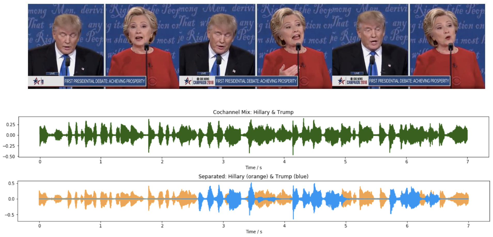
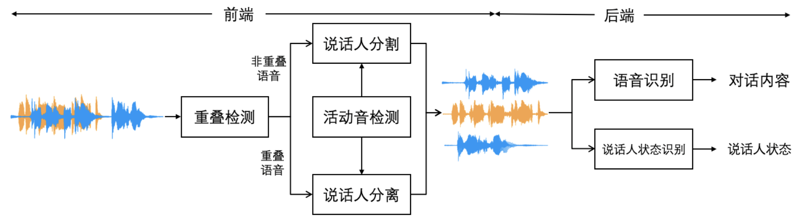
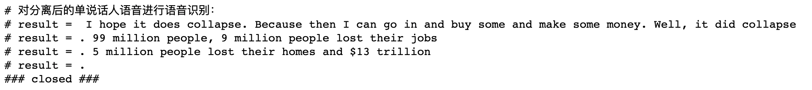
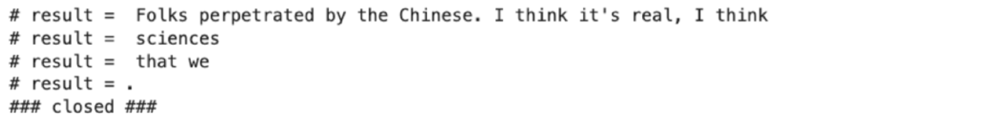

# 
对话场景说话人分离与理解关键技术研究

招梓枫1, 朱利丰1, 2
 

 1 机器人传感与控制研究所, 东南大学, 南京 

 2 生物电子学国家重点实验室, 东南大学, 南京 

## 介绍

对话场景是一个复杂的说话人信息交换过程。说话人将其表达意图通过发音系统以语音信号的形式传递给听者，而听者的双耳拾取语音信号后通过听神经将对应的神经冲动传递给听觉中枢，由听觉中枢处理并完成最终的听觉感知。如下图所示，在2说话人或多说话人对话场景中，一种常见的情形是说话人语音出现相互重叠，例如2个说话人同时发言、新说话人中途插入、听者给出反馈等情形都会因2个甚至多个说话人同时讲话而造成语音信号的共信道混合。一个常用的方法是通过说话人分离进行说话人无关的盲源分离，从包含2个或多个语音的混合信号中为每个说话人分离出各自的语音。在深度学习技术的加速下，单通道说话人分离获得了快速发展，然而对于真实对话场景仍缺乏充分的研究，在开放环境下的泛化效果仍较差。

  

  
对话场景下说话人之间的语音共信道混合现象

   
本课题着重研究了前沿单通道说话人分离方法在贴近真实环境的对话场景中所存在的问题。为了测试分离方法在对话场景中的表现，本课题基于2016年美国总统大选电视辩论制作了测试语料，使用真实的对话语料取代以往的播音数据与朗读文本;本课题自建了采样条件更丰富、说话人分布更多样的大规模语料库用于深度网络的训练，有效地减小了模型的跨数据集评估衰减，提高了单通道分离方法在对话场景中的泛化性能。

如下图所示，本课题在说话人分离的研究基础上，有机结合语音重叠检测、说话人分割(SD)、活动音检测(VAD)、说话人分离(SS)等前端处理模块，以及语音识别(ASR)、声纹识别(SV)、语音情感识别等后端识别模块构建了一个面向对话场景的机器听觉感知综合系统，对视频理解分析、智能机器人、自然人机交互、智能助听设备设计等应用有一定参考意义。

  

  
对话场景机器听觉感知与理解系统

## 效果演示

#### 2说话人语音分离与识别

| 
分离Hillary Clinton (屏蔽Donald Trump)
 | 
分离Donald Trump (屏蔽Hillary Clinton)
 | 
原始视频
 |
| :--- | :--- | :--- |
|<video id="video" controls preload poster=""><source id="mp4" src="https://user-images.githubusercontent.com/87401944/158050310-b2ac9e8d-af49-4f49-952d-daf7e26a9874.mp4" type="video/mp4"></videos>|<video id="video" controls preload poster=""><source id="mp4" src="https://user-images.githubusercontent.com/87401944/158050314-614f801e-ca74-4b17-8ce4-ea1b79f81908.mp4" type="video/mp4"></videos>|<video id="video" controls preload poster=""><source id="mp4" src="https://user-images.githubusercontent.com/87401944/158050264-d92fb19b-fd1a-48ba-842a-cb50e7a6e5a7.mp4" type="video/mp4"></videos>|
||| 
---
 |
|<video id="video" controls preload poster=""><source id="mp4" src="https://user-images.githubusercontent.com/87401944/158050586-695be9e2-425e-40bf-95eb-bc56ed87818e.mp4" type="video/mp4"></videos>|<video id="video" controls preload poster=""><source id="mp4" src="https://user-images.githubusercontent.com/87401944/158050590-961c1b8c-31f4-4eb0-b5df-ca310fc9408f.mp4" type="video/mp4"></videos>|<video id="video" controls preload poster=""><source id="mp4" src="https://user-images.githubusercontent.com/87401944/158050584-3546465b-dee5-4723-b305-0700743f27f1.mp4" type="video/mp4"></videos>|
||| 
---
 |
|<video id="video" controls preload poster=""><source id="mp4" src="https://user-images.githubusercontent.com/87401944/158050627-70f05787-0d4e-4bd7-b385-f6a95f975813.mp4" type="video/mp4"></videos>|<video id="video" controls preload poster=""><source id="mp4" src="https://user-images.githubusercontent.com/87401944/158050631-9704acbd-d84a-4079-b6df-60e0c751d870.mp4" type="video/mp4"></videos>|<video id="video" controls preload poster=""><source id="mp4" src="https://user-images.githubusercontent.com/87401944/158050624-37ab323d-f657-41e5-8086-07e944a73b57.mp4" type="video/mp4"></videos>|
||| 
---
 |

<!---
https://user-images.githubusercontent.com/87401944/158050310-b2ac9e8d-af49-4f49-952d-daf7e26a9874.mp4
https://user-images.githubusercontent.com/87401944/158050314-614f801e-ca74-4b17-8ce4-ea1b79f81908.mp4
https://user-images.githubusercontent.com/87401944/158050264-d92fb19b-fd1a-48ba-842a-cb50e7a6e5a7.mp4

https://user-images.githubusercontent.com/87401944/158050586-695be9e2-425e-40bf-95eb-bc56ed87818e.mp4
https://user-images.githubusercontent.com/87401944/158050590-961c1b8c-31f4-4eb0-b5df-ca310fc9408f.mp4
https://user-images.githubusercontent.com/87401944/158050584-3546465b-dee5-4723-b305-0700743f27f1.mp4

https://user-images.githubusercontent.com/87401944/158050627-70f05787-0d4e-4bd7-b385-f6a95f975813.mp4
https://user-images.githubusercontent.com/87401944/158050631-9704acbd-d84a-4079-b6df-60e0c751d870.mp4
https://user-images.githubusercontent.com/87401944/158050624-37ab323d-f657-41e5-8086-07e944a73b57.mp4
-->

## 链接

[[机器人传感与控制研究所](https://ins.seu.edu.cn/26900/list2.htm)] [[生物电子学国家重点实验室](https://sklb.seu.edu.cn/18466/list.htm)] [[Demo GitHub](https://github.com/ZhaZhaFon/demo-speakerseparation)]

## 参考资料

[1] Pariente M, Cornell S, Cosentino J, et al. Asteroid: the PyTorch-based audio source separation toolkit for researchers[J]. arXiv preprint arXiv:2005.04132, 2020.  
[2] Bredin H, Yin R, Coria J M, et al. Pyannote. audio: neural building blocks for speaker diarization[C]//ICASSP 2020-2020 IEEE International Conference on Acoustics, Speech and Signal Processing (ICASSP). IEEE, 2020: 7124-7128.   
[3] Silero Team. Silero VAD: pre-trained enterprise-grade Voice Activity Detector (VAD), Number Detector and Language Classifier. GitHub repository 2021
[4] Luo Y, Mesgarani N. Conv-tasnet: Surpassing ideal time–frequency magnitude masking for speech separation[J]. IEEE/ACM transactions on audio, speech, and language processing, 2019, 27(8): 1256-1266.  
[5] Desplanques B, Thienpondt J, Demuynck K. Ecapa-tdnn: Emphasized channel attention, propagation and aggregation in tdnn based speaker verification[J]. arXiv preprint arXiv:2005.07143, 2020.  
 
